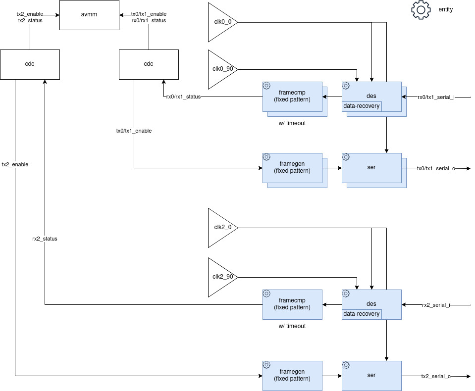

# RJ45 LVDS Tester

## Register Map

| Address | Register         | Description                     |
|---------|------------------|---------------------------------|
|     0x0 | Link 0 Tx Enable | Bit 0 enables TX from Link 0    | 
|     0x4 | Link 0 Rx Status | Show Status of the Link 0 |
|     0x8 | Link 1 Tx Enable | Bit 0 enables TX from Link 1    |
|     0xc | Link 1 Rx Status | Show Status of the Link 1 |
|    0x10 | Link 1 Tx Enable | Bit 0 enables TX from Link 2    |
|    0x14 | Link 1 Rx Status | Show Status of the Link 2 |

Status: If at least 1 frame was received sucessfully we consider that we have a link. 1 = No Link, 2 = Link Up

## Component

### Ports

| Port           | Direction | Description             |
|----------------|-----------|-------------------------|
| sysclk         | in        | avmm clock              | 
| reset_n        | in        | Reset Input             |
| avmm           | -         | Avalon Memory Map       |
| clk0_clk       | in        | clock 0 degrees link 0/1  |
| clk0_clk90     | in        | clock 90 degrees link 0/1 |
| clk2_clk       | in        | clock 0 degrees link 2  |
| clk2_clk90     | in        | clock 90 degrees link 2 |
| rj45a_connector |  -        | tx0/rx1/tx2   |
| rj45b_connector |  -        | rx0/tx1/rx2    |

### Generics

| Port              | Description |
|-------------------|-----------|
| PERIOD SYNC  (us) | Period between syncs on each tx interface (the interface are not synchronized with each other) |
| Link 0/1 FREQUENCY (MHZ) | clk0, and clk1 interfaces clock for link 0 and link 1 |
| Link 0/1 FREQUENCY (MHZ) | Frame length in bytes |
| Link 2 FREQUENCY (MHZ) | clk0, and clk1 interfaces clock for link 2 |
| Link 2 FREQUENCY (MHZ) | Frame length in bytes |

## Internal Architecture

### SEDES

The PREAMBLE of the ser/des is fixed as "1111110". Both modules have the same generics that should match on boths sides along with the frequency.

#### Generics

| Port              | Description  |
|-------------------|--------------|
| BYTES_COUNT       | Frame Length |

### Serializer

The serializer implementation receives a Avalon Streaming Interface where the clock is the same used to transmition. The interface becomes ready every 8 cycles and should be valid at this point, if not the frame will be padded as zeros e be send corrupted. 
If the frame is slower than the configure frame size, the frame is padded as zeros. If the frame is longer, the output is truncated.

The transmition is started whereven there is valid data at the input.

#### Ports

| Port           | Direction | Description             |
|----------------|-----------|-------------------------|
| clk0           | in        | used as transmition clok | 
| reset_n        | in        | Reset Input             |
| avst           | in        | Avalon Streaming        |
| tx_serial_o    | out       | Serial LVDS Output      |

### Desserializer

The deserializer uses internaly the https://github.com/Selgron/fpga-lib-analog-data_recovery converted to avalon streaming.
It will always create a frame with a fixed size, the length encoding and CRC is not available on this layer.

#### Generics

| Port              | Description  |
|-------------------|--------------|
| BYTES_COUNT       | Frame Length |

#### Ports

| Port           | Direction | Description             |
|----------------|-----------|-------------------------|
| clk0           | in        | Used as sysclk | 
| clk90          | in        | 90 degrees from clk0 used do decode the data | 
| reset_n        | in        | Reset Input             |
| avst           | out       | Avalon Streaming        |

